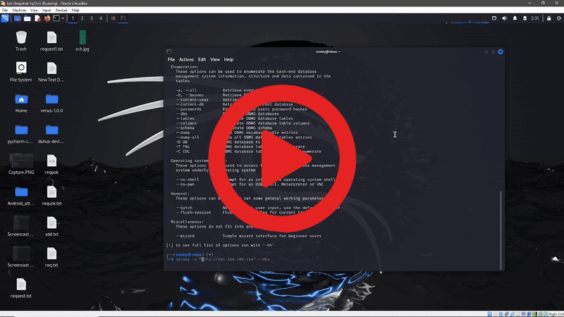

# sql_map
SQLMap Automation Tool A lightweight Python script to simplify and automate SQLMap usage for detecting SQL Injection vulnerabilities. Just enter a target URL, method, and optional data — and let the tool handle the rest.
[](https://drive.google.com/file/d/1S86NJDPyloMJeLFk9GN-kCFLQTuAtmCb/view?usp=sharing)
# SQLMap Automation with Burp Suite Integration

This project provides a Python-based automation script that integrates with Burp Suite to streamline the use of SQLMap for detecting SQL Injection vulnerabilities. The script executes SQLMap using an HTTP request file captured through Burp Suite and saves the output along with a screenshot for reporting purposes.

## Overview

Manual SQL injection testing using SQLMap can be time-consuming, especially when dealing with raw HTTP requests intercepted from applications. This script simplifies the process by allowing penetration testers to:

- Export raw HTTP requests from Burp Suite.
- Execute SQLMap with minimal user interaction using the `--batch` flag.
- Automatically save output results in a structured folder.
- Capture a screenshot of the current screen (e.g., terminal result) for documentation.

## Features

- Supports raw HTTP requests exported from Burp Suite via "Copy as request".
- Executes SQLMap in non-interactive mode using the specified request.
- Automatically creates an output directory based on timestamp.
- Captures a screenshot of the current screen after execution using `pyautogui`.
- Helps automate and document SQL injection testing procedures efficiently.

## Requirements

- Python 3.6 or higher
- SQLMap (installed and accessible in system PATH)
- Burp Suite (Community or Professional Edition)
- Python module: `pyautogui`

Install dependencies via pip:

```bash
pip install pyautogui
